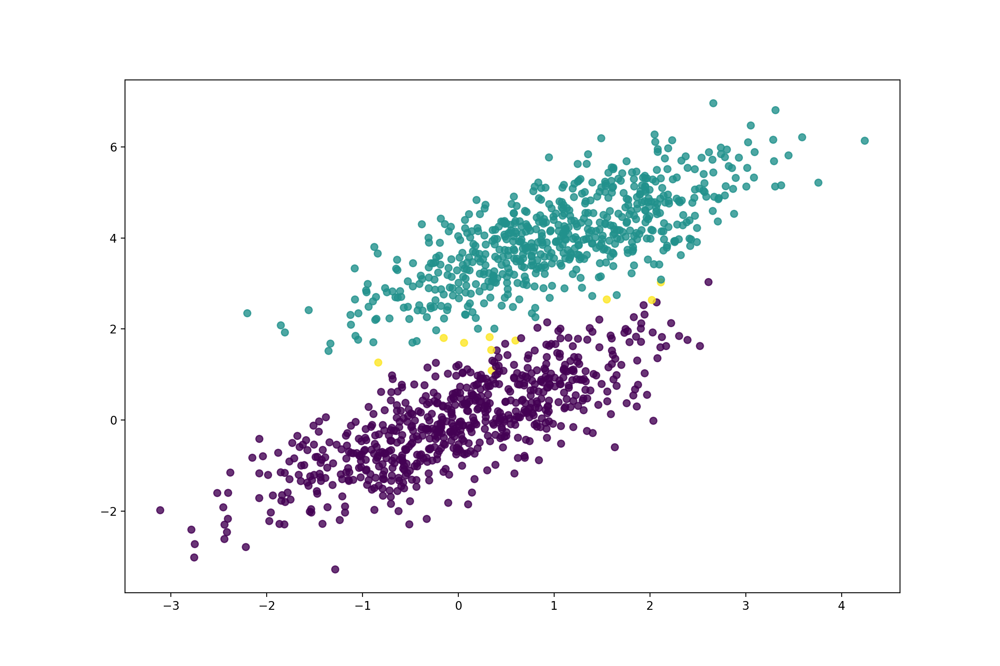
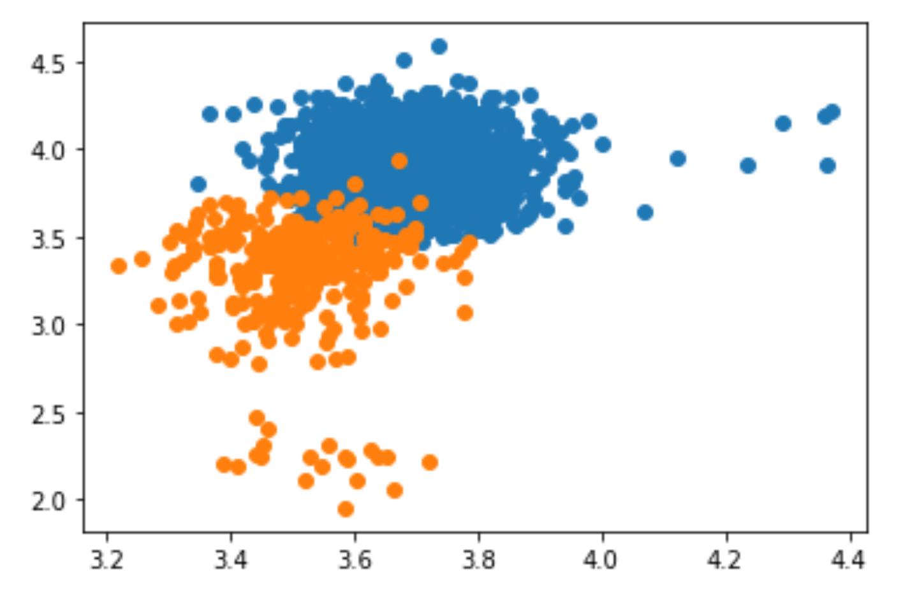

# Machine Learning Portfolio
An assembly of various machine learning models I've worked on.

## Setup

This common setup process should get you to a point where you can use anything provided here!

This project is best used by installing packages in a Python virtual environment.
Here are the basic steps:

Make a new virtual environment
```
python3 -m venv env
```

Source the new environment
```
source env/bin/activate
```

Install the required pacakges
```
pip install -r requirements.txt
```

From there, run Typer's help command to see what options are available.

```
python main.py --help
```
> Commands:
  perceptron
  regression
  ...


And run individual commands by specifying an option from the given list

```
python main.py perceptron
```

## Perceptron

#### Theory

A perceptron is a neural network that separates linearly separable data (single layer).
Weights are adjusted based off an error measurements and a learning rate.

#### Example

More to come...

```shell script
python main.py perceptron
```

After running the model, we see Percy the perceptron separated the data!


#### Use

```python
from ML.perceptron import Perceptron

# percy the Perceptron
percy = Perceptron(rate=rate, n_iter=200)
percy.fit(X, y)
```


## Regression using Gradient Descent

#### Theory

Regression is a classification that predicts a dependent variable from a input of independent variables.
Gradient descent is used to minimize the sum of squares error, resulting in a best fit line in the form `y = m*x + b`.

The algorithm is roughly as follows:

```
for index in Range:
    get new predicted y values
    get the error of those y values
    
    get the adjustment factors for the gradient descent
    adjust m and b
```

#### Example

Let's use sepal width of Viriginica Iris to predict their sepal width!
Let's use [Typer](https://github.com/tiangolo/typer) to run the following command:

```shell script
python main.py regression
```

After running the model, we can see that our line fits the data pretty well!


#### Use

`x` and `y` should be Pandas Series, X should be your independent variables, y should be your dependent variable.

```python
from ML.regression import Regression

regression = Regression(x, y)
regression.fit()

print(regression)
```

## Decision Stump

#### Theory

A decision stump is a classification tree that is only one level deep.
While they aren't super accurate alone since they only shatter the data in one dimension, they are widely used in more sophisticated models such as in boosting algorithms.
The algorithm is roughly as follows:

```
for dimension in Dimensions:
    get the min/max in that dimension
    calculate the step size
    
    for split in Data:
        calculate classification off of splits
        if the error is minimized, store that as an 'ideal' split
```

#### Example

Decision stumps are simple enough that they're mainly useful in more complex applications.
They can be chained together to be able to shatter a data set more accurately.
Boosting is one algorithm that strategically uses a basic model like a decision tree to maximize results.

For me, the easiest use case was just a binary decision between iris types from the classic iris dataset.
Let's grab two iris, how about Setosa and Versicolor, and classify them on their 'petal_l' and 'petal_w' features.
We should:

1. Load in the data
2. Get those data described above
3. Fit our model on that data 
4. Plot our fitted split

Fortunately, all of this is already implemented in a function in `main.py`.
Thanks to [Typer](https://github.com/tiangolo/typer) we can run the following command:

```shell script
python main.py stump
```

From the model, we have our split and can see that it separates our data set as expected.


#### Use

`data` should be a a matrix of training data, with dimensions as columns.
`labels` should be the correct classification labels.

```python
from ML.stump import Stump

stump = Stump(data, labels)
stump.fit()

print(stump)
```

## Logistic Regression

#### Theory

Logistic regression is a linear classifier that uses a series of weights and an intercept with a sigmoid cost function to predict an input's class.
It traditionally accepts data and the appropriate classes and then uses the sigmoid function to fit the data.

#### Example

I generated some random normal data and used scikit's test/train split tool to separate my data into two groups.
If you run the `logistic_regression.py` file, the following example will use this data.
The first group of data I trained on, for 2000 iterations and a learning rate of 0.0001.
The next group, I predict using the fit model and measure the accuracy as well as output a graph.
It takes a second for the model to fit, used to be quicker when I had the iterations lower and the learning rate more coarse.
However, the logistic regression achieves an impressive 99% accuracy on this rather tricky dataset. 



#### Usage

```python
from ML.logistic_regression import LogisticRegression

# features must be of shape (-1, 2)
model = LogisticRegression(2000, 0.0001)
model.fit(features, classes)

print(model)
```

## SVM

Find my video demonstration and example code of an SVM at this Youtube video link:

[](https://www.youtube.com/watch?v=AjpTCH-_fmY)

Or go straight to the Github page [Here](https://github.com/timwford/svm_audio_classification)

This project included making my own dataset, finding my own features, making a model from scratch, and then exposing the model over a small webserver.
To see the 'most complete' form of this project, fire up Pycharm and run the `run_fastapi` configuration.
Then follow the link to the localhost server.
If you open the interactive docs at the link suggested, it will present you with auto-generated OpenAPI docs.
Click on the `/status` GET request to expand the endpoint's docs and then click 'Try it Out' and then run 'Execute' to call the endpoint.
This will record from your mic for 4 seconds. 
If your surroundings are quiet, it should return 'OFF' in the JSON. 
If it detects a constant white noise, best produced by a running water near your computer's default mic, it will produce an 'ON' value.
Lastly, if it detects a consistent percussive noise, best produced by a high-gain recording of a dripping faucet, it will report a 'DRIP value',
This configuration might have difficulty running on a non MacOS Catalina/Macbook Pro 16" due to the hardware interface.
If there is difficulty, please file an issue so I can make this script more platform agnostic.

## KNN

A KNN uses euclidean distance to calculate what class a test point should be in.

### Distance and a Class

First, I decided that since we're going to be talking about euclidean space, we should come up with a construct that easily determines position in a 2-d plane.
Here is the class I made that holds an (x,y) pair:

```python
class Point:
    def __init__(self, x, y, label=None):
        self.x = x
        self.y = y
        self.label = label
        self.distance = None

    def __str__(self):
        return f"({self.x}, {self.y})"

    def __lt__(self, other):
        return self.distance < other.distance
```

It starts out with just an x and y value. 
The '__str__' override just make the object easy to work with.
And the '__lt__' override allows me to easily sort the points by distance (important for later).

The distance member variable is used in the KNN in conjunction with this function (just your average euclidean distance forumula):

```python
    def distance(self, x: Point, y: Point):
        if x is None or y is None:
            return "Unable to do anything"

        if x.x is None or x.y is None or y.x is None or y.y is None:
            return "Unable to classify"

        return np.sqrt(np.square(x.x - y.x) + np.square(x.y - y.y))
```

Now that we have this class and a way to determine distance, we can build our model.

# KNN Classifier

The KNN classifier has a couple basic steps.
Firstly, we need to iterate through our training dataset and calculate the distances between our new 'test' point and all the points in our training dataset.
We'll also grab all the unique labels in the dataset while we're looping through the training data.

```python
unique_labels = []
        for p in self.data:
            p.distance = self.distance(p, input_value)
            if p.label not in unique_labels:
                unique_labels.append(p.label)
```

Next, we'll sort the points by distance, with those closest to our training point at the beginning.
We'll then grab the k-nearest points.

```python
self.data.sort()
k_nearest = self.data[:self.k]
```

Lastly, we need to find which class is most 'dominant' for our test point.
We'll do this by using our unique label list to initalize a dictionary to values of 0 for each label.
Then, we just have to key into our dictionary to add a 'count' to a label.

```python
        dominant_class = {}
        for label in unique_labels:
            dominant_class[label] = 0

        for p in k_nearest:
            dominant_class[p.label] += 1
```

Then, lastly, we'll just take whatever class has the most nearest points and this is our predicted class!

```python
return max(dominant_class, key=dominant_class.get)
```

### Ramen Classification

I decided to take the dataset below and engineer some features for predicting Ramen quality.
I used 'Country' and 'Style' for my starting point, I grouped by these variables and then took the mean of the reviews those groups received.
Then, since the reviews fell pretty hard onto their 'average review lines', I added some normally distributed jitter to give 'distance' more significance for the KNN.

[Data Set](https://www.kaggle.com/residentmario/ramen-ratings)

These features ended up separating pretty nicely into a 'bad ramen' (with lower average rating) group and a 'good ramen' group, with the boundary being the average of all ramen reviews!



For a quick example, it turns out that ramen from a ('Bowl': 3.67 'Pack': 3.70 'Box': 4.29 'Bar': 5.00) has a higher average review.
However, the lower average review for ramen came from ramen packaged in ('Cup': 3.50 'Can': 3.50 'Tray': 3.55).

All the exploratory analysis used to find all of this out and make my final csv used for training can be found in 'exploration/Ramen Eploration.pdf' or in its Jupyter notebook of the same name.

### A Web App

It's very helpful to be able to be able to expose a ML model over a web app, this way it can be used anywhere and by anyone.
FastAPI, a small ASGI web framework, does a fantastic job of this!

First, for our response and request body, we need to declare a Pydantic model (provides type validation and JSON structure).

```python
class EatTheRamenSchema(BaseModel):
    eat_the_ramen: str


class RamenInput(BaseModel):
    country: str
    style: str
```

Now, we need a small class that contains our ML model.

```python
class EatTheRamen:
    def __init__(self):
        df = pd.read_csv("final_ramen.csv")

        style_points = df['Style_value_jitter']
        country_points = df['Country_value_jitter']
        labels = df['label'].astype(str)

        points = []
        for i in range(len(style_points)):
            points.append(Point(style_points[i], country_points[i], labels[i]))

        model = KNN(15, points)

        self.model = model
```

Now, we create our endpoint that allows you to predict whether your own ramen will taste good!

```python
@app.post("/ramen", response_model=EatTheRamenSchema)
async def should_i_eat_the_ramen(ramen: RamenInput):
    if can_classify_ramen(ramen.country, ramen.style):
        print("can classify")
        result = eatTheRamenator.model.predict(generate_ramen_point(ramen.country, ramen.style))
    else:
        print("cannot classify")
        result = generate_ramen_point(ramen.country, ramen.style)

    return EatTheRamenSchema(
        eat_the_ramen=result
    )
```

Lastly, Uvicorn, a lightweight ASGI server, is used to serve the web app.

```python
if __name__ == "__main__":
    uvicorn.run("ramen_classification:app", host="127.0.0.1", port=5000, log_level="info")
```  

You can get this running local host by going to the 'examples/' folder and install the `requirements.txt` from there (it's pretty big so probably use a virtual environment).
Then, you can either use the Pycharm configuration or just run the 'ramen_classification.py' file as follows

```shell script
python ramen_classification.py
```

Head to the link it spits out in the terminal and you should be greeted with a root page to either visit th localhost or hosted version!

[You can expermient with it yourself here!](https://homemetricsdev.uc.r.appspot.com/docs#/default/should_i_eat_the_ramen_ramen_post) 

