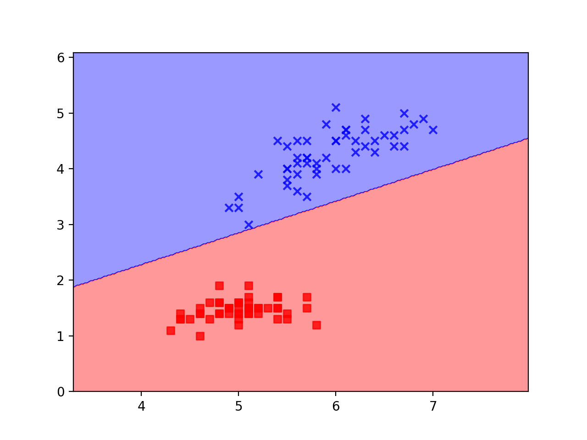
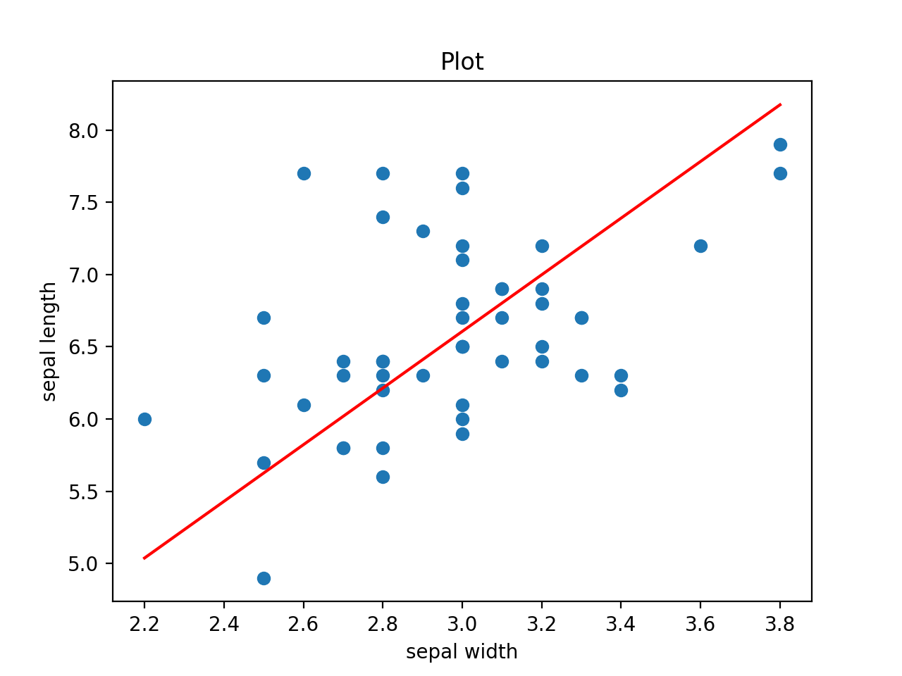
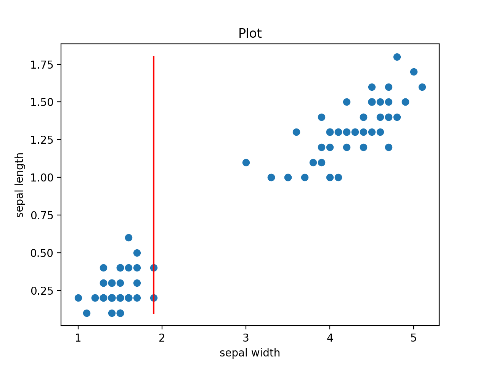

# Machine Learning Portfolio
An assembly of various machine learning models I've worked on.

## Setup

This common setup process should get you to a point where you can use anything provided here!

This project is best used by installing packages in a Python virtual environment.
Here are the basic steps:

Make a new virtual environment
```
python3 -m venv env
```

Source the new environment
```
source env/bin/activate
```

Install the required pacakges
```
pip install -r requirements.txt
```

From there, run Typer's help command to see what options are available.

## Perceptron

#### Theory

A perceptron is a neural network that separates linearly separable data (single layer).
Weights are adjusted based off an error measurements and a learning rate.

#### Example

More to come...

```shell script
python main.py perceptron
```

After running the model, we see Percy the perceptron separated the data!



#### Use

```python
from ML.perceptron import Perceptron

# percy the Perceptron
percy = Perceptron(rate=rate, n_iter=200)
percy.fit(X, y)
```


## Regression

#### Theory

Regression is a classification that predicts a dependent variable from a input of independent variables.
Gradient descent is used to minimize the sum of squares error, resulting in a best fit line in the form `y = m*x + b`.

The algorithm is roughly as follows:

```
for index in Range:
    get new predicted y values
    get the error of those y values
    
    get the adjustment factors for the gradient descent
    adjust m and b
```

#### Example

Let's use sepal width of Viriginica Iris to predict their sepal width!
Let's use [Typer](https://github.com/tiangolo/typer) to run the following command:

```shell script
python main.py regression
```

After running the model, we can see that our line fits the data pretty well!



#### Use

`x` and `y` should be Pandas Series, X should be your independent variables, y should be your dependent variable.

```python
from ML.regression import Regression

regression = Regression(x, y)
regression.fit()

print(regression)
```

## Decision Stump

#### Theory

A decision stump is a classification tree that is only one level deep.
While they aren't super accurate alone since they only shatter the data in one dimension, they are widely used in more sophisticated models such as in boosting algorithms.
The algorithm is roughly as follows:

```
for dimension in Dimensions:
    get the min/max in that dimension
    calculate the step size
    
    for split in Data:
        calculate classification off of splits
        if the error is minimized, store that as an 'ideal' split
```

#### Example

Decision stumps are simple enough that they're mainly useful in more complex applications.
They can be chained together to be able to shatter a data set more accurately.
Boosting is one algorithm that strategically uses a basic model like a decision tree to maximize results.

For me, the easiest use case was just a binary decision between iris types from the classic iris dataset.
Let's grab two iris, how about Setosa and Versicolor, and classify them on their 'petal_l' and 'petal_w' features.
We should:

1. Load in the data
2. Get those data described above
3. Fit our model on that data 
4. Plot our fitted split

Fortunately, all of this is already implemented in a function in `main.py`.
Thanks to [Typer](https://github.com/tiangolo/typer) we can run the following command:

```shell script
python main.py stump
```

From the model, we have our split and can see that it separates our data set as expected.



#### Use

`data` should be a a matrix of training data, with dimensions as columns.
`labels` should be the correct classification labels.

```python
from ML.stump import Stump

stump = Stump(data, labels)
stump.fit()

print(stump)
```